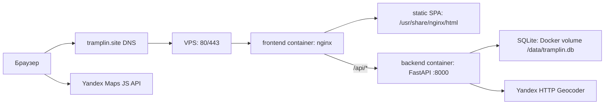

# Трамплин

Трамплин — интерактивная карьерная платформа для студентов, выпускников, работодателей, кураторов и администратора.  
В проекте есть:

- главная страница с картой и лентой возможностей
- карточки вакансий, стажировок, менторских программ и событий
- роли `applicant`, `employer`, `curator`, `admin`
- отклики и статусы откликов
- нетворкинг между соискателями
- рекомендации контактов на вакансии
- модерация и верификация работодателей

## Стек

- Backend: `FastAPI`, `SQLAlchemy`, `Alembic`, `SQLite`
- Frontend: `JavaScript`, `Node.js`, `Vite`, `Bootstrap`
- Карта: `Yandex Maps JavaScript API`
- Геокодирование: `Yandex HTTP Geocoder`

## Структура проекта

- `backend/` — API, модели, миграции и база данных SQLite
- `frontend/` — клиентское приложение на Vite

## Production-архитектура

В production проект запускается через `docker-compose.yml` как два контейнера:



- наружу опубликован только `frontend`-контейнер на портах `80` и `443`
- nginx внутри `frontend` отдает собранный Vite frontend и проксирует `/api/*` в backend
- backend доступен только внутри Docker-сети по имени `backend:8000`
- SQLite-база хранится в named volume `tramplin_backend_data`, а не внутри контейнера
- TLS-сертификаты Let's Encrypt лежат на VPS в `/etc/letsencrypt` и монтируются в nginx read-only
- backend при старте применяет Alembic-миграции и затем запускает FastAPI через Uvicorn

## Что нужно для запуска

- `git`
- `Python 3.11`
- `pip`
- `Node.js 20+`
- `npm`

Если на macOS не установлен `python3.11`, можно поставить его через Homebrew:

```bash
brew install python@3.11
```

## Клонирование репозитория

```bash
git clone https://github.com/NerdySnake6/if-else-hackathon-2026.git
cd if-else-hackathon-2026
```

## Переменные окружения

Перед запуском нужны два файла:

1. `backend/.env`
2. `frontend/.env.local`

Файлы `backend/.env.example` и `frontend/.env.example` лежат в репозитории как шаблоны.

### Как получить ключ Яндекс Карт

1. Перейди на [Yandex Maps API](https://yandex.ru/maps-api/)
2. Открой личный кабинет
3. Нажми `Подключить API`
4. Выбери пакет `JavaScript API и HTTP Геокодер`
5. Создай новый ключ

В проекте используется один и тот же ключ для frontend и backend.

### `backend/.env`

Создай файл `backend/.env`:

```env
YANDEX_GEOCODER_API_KEY=твой_ключ_яндекс_карт
```

Где:

- `YANDEX_GEOCODER_API_KEY` — ключ Яндекс Карт

### `frontend/.env.local`

Создай файл `frontend/.env.local`:

```env
VITE_YANDEX_MAPS_API_KEY=твой_ключ_яндекс_карт
```

Где:

- `VITE_YANDEX_MAPS_API_KEY` — тот же ключ, что и в `backend/.env`

Важно:

- backend автоматически читает `backend/.env` при запуске
- после изменения `backend/.env` или `frontend/.env.local` нужно перезапустить backend и frontend

## Быстрый старт на macOS / Linux

### 1. Запуск backend

```bash
cd backend
python3.11 -m venv venv
source venv/bin/activate
pip install -r requirements.txt
python3.11 -m alembic upgrade head
uvicorn app.main:app 
```

Backend будет доступен по адресу:

- [http://127.0.0.1:8000](http://127.0.0.1:8000)
- Swagger: [http://127.0.0.1:8000/docs](http://127.0.0.1:8000/docs)

### 2. Запуск frontend

Открой второй терминал:

```bash
cd frontend
npm install
npm run dev
```

Frontend будет доступен по адресу:

- [http://127.0.0.1:5173](http://127.0.0.1:5173)

Во время локальной разработки frontend отправляет запросы в backend через Vite proxy на `http://localhost:8000`.

## Быстрый старт на Windows

### 1. Запуск backend

```bash
cd backend
py -3.11 -m venv venv
venv\Scripts\activate
pip install -r requirements.txt
python -m alembic upgrade head
uvicorn app.main:app 
```

### 2. Запуск frontend

Открой второй терминал:

```bash
cd frontend
npm install
npm run dev
```

Адреса останутся теми же:

- backend: [http://127.0.0.1:8000](http://127.0.0.1:8000)
- frontend: [http://127.0.0.1:5173](http://127.0.0.1:5173)

## Запуск через Docker на VPS

В репозитории есть готовая Docker-конфигурация:

- `docker-compose.yml` — поднимает backend и frontend
- `backend/Dockerfile` — FastAPI, Alembic и SQLite
- `frontend/Dockerfile` — production-сборка Vite и nginx

Важно: на VPS используй новый Compose v2 через команду `docker compose`, а не старый `docker-compose`.
Старый `docker-compose 1.29.2` может ломаться на современных версиях Docker Engine с ошибкой
`KeyError: 'ContainerConfig'` при пересоздании контейнеров.

Проверить версию:

```bash
docker compose version
```

Если команда не найдена, можно установить Compose v2 как CLI-плагин:

```bash
sudo mkdir -p /usr/local/lib/docker/cli-plugins
sudo curl -SL https://github.com/docker/compose/releases/download/v2.29.7/docker-compose-linux-x86_64 -o /usr/local/lib/docker/cli-plugins/docker-compose
sudo chmod +x /usr/local/lib/docker/cli-plugins/docker-compose
sudo docker compose version
```

### 1. Подготовить переменные окружения

Создай файл `.env` в корне проекта:

```bash
cp docker.env.example .env
```

Заполни значения:

```env
YANDEX_GEOCODER_API_KEY=твой_ключ_яндекс_карт
VITE_YANDEX_MAPS_API_KEY=твой_ключ_яндекс_карт
TRAMPLIN_SECRET_KEY=случайная_длинная_строка
TRAMPLIN_ADMIN_EMAIL=admin@example.com
TRAMPLIN_ADMIN_PASSWORD=надежный_пароль
TRAMPLIN_ADMIN_NAME=Администратор
FRONTEND_PORT=80
FRONTEND_HTTPS_PORT=443
```

### 2. Запустить проект

```bash
sudo docker compose up -d --build
```

После запуска:

- frontend будет доступен на `http://адрес_сервера`
- backend будет доступен внутри Docker-сети как `backend:8000`
- Swagger и OpenAPI в production закрыты nginx-конфигом

### 3. Проверить состояние контейнеров

```bash
sudo docker compose ps
sudo docker compose logs -f backend
```

При старте backend автоматически применяет миграции Alembic и создает SQLite-базу в Docker volume.

### 4. Обновить проект на VPS

После `git pull` пересобери и перезапусти контейнеры:

```bash
cd ~/if-else-hackathon-2026
git pull
sudo docker compose up -d --build
sudo docker compose ps
```

Проверь production-SEO:

```bash
curl https://tramplin.site/robots.txt
curl https://tramplin.site/sitemap.xml
```

`robots.txt` должен начинаться с `User-agent: *`, а `sitemap.xml` — с XML-заголовка.

## Первый администратор

После применения миграций и первого запуска backend в базе автоматически создается один администратор, если пользователя с ролью `admin` еще нет и явно заданы переменные окружения администратора.

Это происходит после выполнения команд:

```bash
cd backend
source venv/bin/activate
python3.11 -m alembic upgrade head
uvicorn app.main:app --reload
```

Перед первым запуском задай данные администратора в окружении:

```env
TRAMPLIN_ADMIN_EMAIL=admin@example.com
TRAMPLIN_ADMIN_PASSWORD=надежный_пароль
TRAMPLIN_ADMIN_NAME=Администратор
```

Важно:

- администратор создается только если в БД еще нет роли `admin`
- если `TRAMPLIN_ADMIN_EMAIL` или `TRAMPLIN_ADMIN_PASSWORD` не заданы, администратор автоматически не создается
- в базе хранится не открытый пароль, а его хеш
- входить нужно обычным паролем, который был задан при инициализации

При необходимости данные администратора можно переопределить через переменные окружения backend.

## Что проверить после запуска

1. Открывается frontend на `http://127.0.0.1:5173`
2. Открывается backend на `http://127.0.0.1:8000/docs`
3. На главной странице отображаются карта и карточки возможностей
4. Можно войти под администратором, заданным через переменные окружения

## CI/CD

В репозитории настроены GitHub Actions:

- `.github/workflows/ci.yml` — проверка backend и сборка frontend для `push` и `pull_request`
- `.github/workflows/cd.yml` — сборка артефактов на ветке `main`

CI проверяет:

- синтаксис Python-модулей backend
- backend-тесты основных сценариев
- production-сборку frontend

Для workflow может понадобиться GitHub Secret:

- `VITE_YANDEX_MAPS_API_KEY`

## Полезные замечания

- если маркеры на карте не появляются, сначала проверь `backend/.env` и ключ Яндекс Карт
- если менялись `.env`-файлы, всегда перезапускай backend и frontend
- если база не совпадает с миграциями, backend попросит сначала выполнить `alembic upgrade head`
